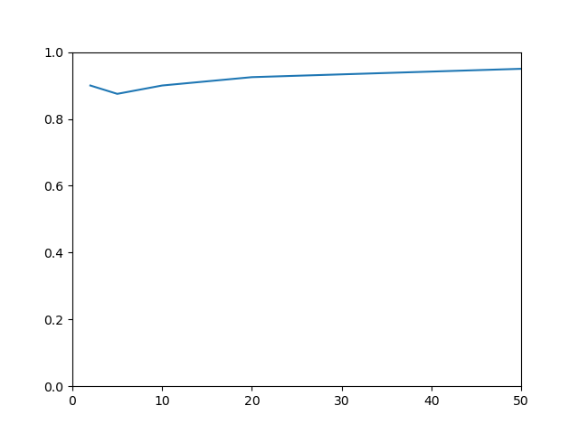

# hw3-neuralnet
HW3: Neural Networks

This assignment contains three data sets that are based on three publicly available benchmarks, each representing a binary classification task:

1. monks1.csv: A data set describing two classes of robots using all nominal attributes and a binary label.  This data set has a simple rule set for determining the label: if head_shape = body_shape ∨ jacket_color = red, then yes (1), else no (0). Each of the attributes in the monks1 data set are nominal.  Monks1 was one of the first machine learning challenge problems (http://www.mli.gmu.edu/papers/91-95/91-28.pdf).  This data set comes from the UCI Machine Learning Repository:  http://archive.ics.uci.edu/ml/datasets/MONK%27s+Problems

2. seismic.csv: A data set of measurements describing seismic activity in the earth, measured from a wall in a Polish coal mine.  The task in this data set is to predict whether there will be a high energy seismic event within the next 8 hours.  The 18 attributes have a mix of types of values: 4 are nominal attributes, and the other 14 are continuous.  The label is a 0 if there was no high energy seismic event in the next 8 hours, and a 1 if there was such an event.  This data set comes the UCI Machine Learning Repository: https://archive.ics.uci.edu/ml/datasets/seismic-bumps

3. mnist_5v8.csv: A data set of optical character recognition of numeric digits from images.  The task in this data set is to predict whether a handwritten number is a “5” or an “8”.  Each instance represents a different grayscale 28x28 pixel image of a handwritten numeric digit.  The attributes are the intensity values of the 784 pixels. Each attribute is ordinal (treat them as continuous for the purpose of this assignment).  The label is a 0 if the handwritten number is a “5”, and a 1 if the handwritten number is an “8”.  This version of MNIST contains 100 instances of the handwritten numeric digits “5” and “8”, randomly sampled from the original training data for MNIST.  The overall MNIST data set is one of the main benchmarks in machine learning: http://yann.lecun.com/exdb/mnist/.  It was converted to CSV file using the python code provided at: https://quickgrid.blogspot.com/2017/05/Converting-MNIST-Handwritten-Digits-Dataset-into-CSV-with-Sorting-and-Extracting-Labels-and-Features-into-Different-CSV-using-Python.html

## 1) Ada Ates & Sagana Ondande
## 2) Research Questions

1) For the monks1.csv data set, pick a training set percentage and a random seed (document both in your README). Use 2 hidden neurons, a learning rate 𝜂 = 0.1, and a threshold of 0.5.
a. What is the test set accuracy you observed for your neural network?
b. Repeat using the same training set percentage, random seed, and learning rate but with your logistic regression solution from Homework 2. What is the test set accuracy you observed for your logistic regression model on the monks1.csv data set?
c. Create 95% confidence intervals for both accuracies. Which learner (neural network or logistic regression) had the highest accuracy? Was the difference statistically significant? What are the implications of your results?

2) For the mnist_5v8.csv data set, pick a random seed. Use a learning rate of 𝜂 = 0.001, a training set percentage of 60%, and a threshold of 0.5. Create a neural network with each of the following numbers of neurons: 2, 5, 10, 20, and 50.
a. What is the test set accuracy you observed for each number of neurons? Plot a line chart (using the tool of your choice: Excel, R, matplotlib in Python, etc.) of the test set accuracy as the number of neurons increased. Include your line chart as an image in your GitHub repository.
- Dataset: mnist_5v8.csv 
- Learning Rate: 0.001
- Training Set Size: 60%
- Threshold: 0.5
- Random Seed: 12345

- Number of Neurons and Accuracy:
  - 2: 
    - Accuracy: 0.9
  - 5:
    - Accuracy: 0.875
  - 10:
    - Accuracy: 0.9
  - 20:
    - Accuracy: 0.925
  - 50:
    - Accuracy: 0.95

Graph of results:

b. How did the accuracy change as the number of hidden neurons change? Why do you think this result occurred?

The accuracy stayed pretty consistently. As we can see from the results, the accuracy rate didn't change as much regardless of how many hidden neurons were used. From this, the results possibly occured as there wasn't any further information that could be learned from each neuron and was resulting more in a consistent result. This could also be a case
of overfitting as there's no neew information being learned from the neurons. We could see that with the information given, it is sometimes better for us to use more hidden neurons but in terms of the accuracy, it stays in the confidence interval. The more neurons we use, the more informed out neural network becomes. At the same time, we need to take into account 
the factors of overfitting and reducing the likihood of that happening to the model. From this, we can find that there is an optimal amount of hidden neurons that we can use that will produce a consistent higher accuracy without worry of the model overfitting. 

3) For the mnist_5v8.csv data set, use the three learning rates 𝜂 = 0.001, 0.01, 0.1. Use the number of neurons that gave the highest accuracy in Q2 (in case of ties, use the smallest number of neurons that tied for the highest accuracy), a training percentage of 60%, a threshold of 0.5, and the same random seed used in Q2. Track the accuracy on both the training set the validation set after each epoch of Backpropagation (i.e., after you feed the entire training set in).
a. Plot the accuracy of the network on the training set for each epoch on a single line chart (again using your favorite tool) for all three learning rates (each learning rate should be a separate line on the same chart, where the x-axis is the epoch and the y-axis is the training set accuracy) . Include your line chart as an image in your GitHub repository.
b. Plot the accuracy of the network on the validation set for each epoch on a single line chart (again using your favorite tool) for all three learning rates (each learning rate should be a separate line on the same chart, where the x-axis is the epoch and the y-axis is the validation set accuracy) . Include your line chart as an image in your GitHub repository.
c. Compare the training set accuracy across the three learning rates. What trends do you observe in your line charts? What do you think this implies about choosing a learning rate?
d. Compare the validation set accuracy across the three learning rates. What trends do you observe in your line charts? What do you think this implies about choosing a learning rate?

4) For the seismic.csv data set, use 10 hidden neurons, a learning rate 𝜂 = 0.01, a training percentage of 60%, and your favorite random seed. Using five different thresholds (0.05, 0.1, 0.5, 0.9, 0.95) for converting the predicted probabilities into predicted labels, calculate the accuracy and recalls of your trained neural network on the test set.
a. What were the test set accuracies you observed for each threshold value? How did they change as the threshold changed? 
- Dataset: seismic.csv 
- Number of Hidden Neurons: 10 
- Learning Rate: 0.05
- Training Set Size: 60%
- Random Seed: 12345

- Threshold: 0.05
  - Accuracy: 0.9
- Threshold: 0.1
  - Accuracy: 0.925 
- Threshold: 0.5
  - Accuracy: 0.925  
- Threshold: 0.9
  - Accuracy: 0.85 
- Threshold: 0.95
  - Accuracy: 0.725

b. What were the recalls on each label that you observed for each threshold value? How did they change as the threshold changed?
- Threshold: 0.05
  - Recall of label _0_: 0.7647058823529411
  - Recall of label _1_: 1.0
- Threshold: 0.1
  - Recall of label _0_: 0.7647058823529411
  - Recall of label _1_: 1.0
- Threshold: 0.5
  - Recall of label _0_: 0.9411764705882353
  - Recall of label _1_: 0.9130434782608695
- Threshold: 0.9
  - Recall of label _0_: 1.0
  - Recall of label _1_: 0.7391304347826086
- Threshold: 0.95
  - Recall of label _0_: 1.0
  - Recall of label _1_: 0.5217391304347826
c. Remembering that a label of 1 is predicting a seismic event, and a label of 0 is predicting that there is no seismic event, which threshold do you think is ideal for this data set? Why do you think this threshold is the best?

I would choose threshold 0.5 as the threshold value for this dataset. This comes in combination of being one of the highest accuracy rates, but also through the recall results. The importance of the recall is that it is one of the best to evaluate how well the learned model
generalizes to all possible data. This would be beneficial for this dataaset as we want to have the trained model be able to work with predicting seismic events without as much worry that the model was overfitted to the training data. 
## 3) A short paragraph describing your experience during the assignment (what did you enjoy, what was difficult, etc.)
## 4) An estimation of how much time you spent on the assignment, and
## 5) An affirmation that you adhered to the honor code