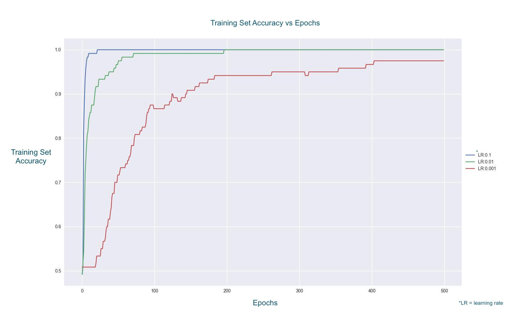
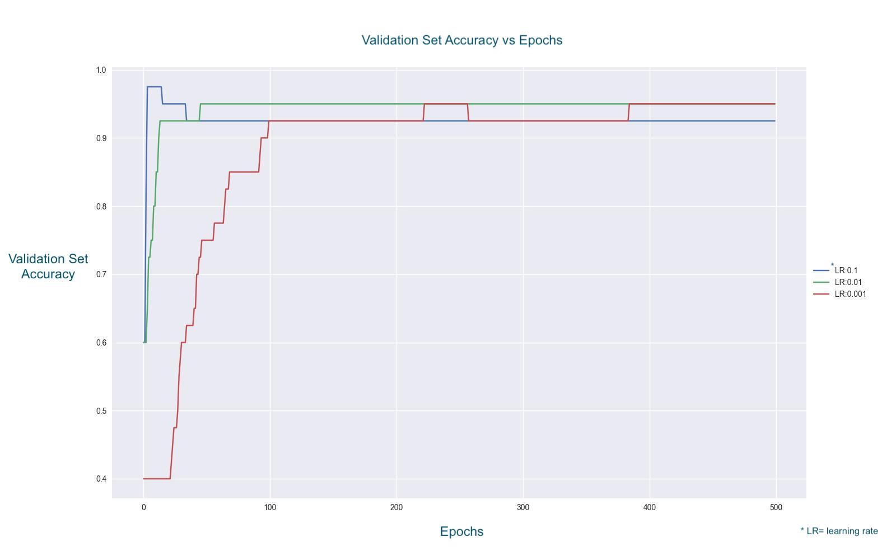

# hw3-neuralnet
HW3: Neural Networks

This assignment contains three data sets that are based on three publicly available benchmarks, each representing a binary classification task:

1. monks1.csv: A data set describing two classes of robots using all nominal attributes and a binary label.  This data set has a simple rule set for determining the label: if head_shape = body_shape ∨ jacket_color = red, then yes (1), else no (0). Each of the attributes in the monks1 data set are nominal.  Monks1 was one of the first machine learning challenge problems (http://www.mli.gmu.edu/papers/91-95/91-28.pdf).  This data set comes from the UCI Machine Learning Repository:  http://archive.ics.uci.edu/ml/datasets/MONK%27s+Problems

2. seismic.csv: A data set of measurements describing seismic activity in the earth, measured from a wall in a Polish coal mine.  The task in this data set is to predict whether there will be a high energy seismic event within the next 8 hours.  The 18 attributes have a mix of types of values: 4 are nominal attributes, and the other 14 are continuous.  The label is a 0 if there was no high energy seismic event in the next 8 hours, and a 1 if there was such an event.  This data set comes the UCI Machine Learning Repository: https://archive.ics.uci.edu/ml/datasets/seismic-bumps

3. mnist_5v8.csv: A data set of optical character recognition of numeric digits from images.  The task in this data set is to predict whether a handwritten number is a “5” or an “8”.  Each instance represents a different grayscale 28x28 pixel image of a handwritten numeric digit.  The attributes are the intensity values of the 784 pixels. Each attribute is ordinal (treat them as continuous for the purpose of this assignment).  The label is a 0 if the handwritten number is a “5”, and a 1 if the handwritten number is an “8”.  This version of MNIST contains 100 instances of the handwritten numeric digits “5” and “8”, randomly sampled from the original training data for MNIST.  The overall MNIST data set is one of the main benchmarks in machine learning: http://yann.lecun.com/exdb/mnist/.  It was converted to CSV file using the python code provided at: https://quickgrid.blogspot.com/2017/05/Converting-MNIST-Handwritten-Digits-Dataset-into-CSV-with-Sorting-and-Extracting-Labels-and-Features-into-Different-CSV-using-Python.html

## 1) Ada Ates & Sagana Ondande
## 2) Research Questions

1) For the monks1.csv data set, pick a training set percentage and a random seed (document both in your README). Use 2 hidden neurons, a learning rate 𝜂 = 0.1, and a threshold of 0.5.

Training set percentage = 0.6, random seed = 12345

a. What is the test set accuracy you observed for your neural network?

Test accuracy is 1.0 for our neural network with the given parameters.

b. Repeat using the same training set percentage, random seed, and learning rate but with your logistic regression solution from Homework 2. What is the test set accuracy you observed for your logistic regression model on the monks1.csv data set?

Test set accuracy for our logistic regression from Homework 2 with the same parameters is ~0.77 (accuracy = 0.7701149425287356).

c. Create 95% confidence intervals for both accuracies. Which learner (neural network or logistic regression) had the highest accuracy? Was the difference statistically significant? What are the implications of your results?

Confidence Interval for Neural Network: [1.0, 1.0]

Confidence Interval for Logistic Regression: [0.7303, 0.8097]

Our neural network has a higher accuracy than our logistic regression.
When confidence intervals pass 0.95, it means that there is no difference between two groups of the study. In this case, neural network produces results that are not significantly different than actual labels because there is 100% likelihood that the range of predicted labels cover true labels. There is no uncertainty.

However, in our logistic regression, the confidence interval is 0.73 to 0.80, which means that 73-80% of the time we can have confidence in the accuracy of our results. This is less confident than our neural network, which means that our neural network is learning better and therefore producing more accurate results.

2. For the mnist_5v8.csv data set, pick a random seed. Use a learning rate of 𝜂 = 0.001, a training set percentage of 60%, and a threshold of 0.5. Create a neural network with each of the following numbers of neurons: 2, 5, 10, 20, and 50.
a. What is the test set accuracy you observed for each number of neurons? Plot a line chart (using the tool of your choice: Excel, R, matplotlib in Python, etc.) of the test set accuracy as the number of neurons increased. Include your line chart as an image in your GitHub repository.
- Dataset: mnist_5v8.csv 
- Learning Rate: 0.001
- Training Set Size: 60%
- Threshold: 0.5
- Random Seed: 12345

- Number of Neurons and Accuracy:
  - 2: 
    - Accuracy: 0.9
  - 5:
    - Accuracy: 0.875
  - 10:
    - Accuracy: 0.9
  - 20:
    - Accuracy: 0.925
  - 50:
    - Accuracy: 0.95

b. How did the accuracy change as the number of hidden neurons change? Why do you think this result occurred?

The accuracy stayed pretty consistently. As we can see from the results, the accuracy rate didn't change as much regardless of how many hidden neurons were used. From this, the results possibly occured as there wasn't any further information that could be learned from each neuron and was resulting more in a consistent result. This could also be a case
of overfitting as there's no new information being learned from the neurons. We could see that with the information given, it is sometimes better for us to use more hidden neurons but in terms of the accuracy, it stays in the confidence interval. The more neurons we use, the more informed out neural network becomes. At the same time, we need to take into account 
the factors of overfitting and reducing the likelihood of that happening to the model. From this, we can find that there is an optimal amount of hidden neurons that we can use that will produce a consistent higher accuracy without worry of the model overfitting. 

3. For the mnist_5v8.csv data set, use the three learning rates 𝜂 = 0.001, 0.01, 0.1. Use the number of neurons that gave the highest accuracy in Q2 (in case of ties, use the smallest number of neurons that tied for the highest accuracy), a training percentage of 60%, a threshold of 0.5, and the same random seed used in Q2. Track the accuracy on both the training set the validation set after each epoch of Backpropagation (i.e., after you feed the entire training set in).

a. Plot the accuracy of the network on the training set for each epoch on a single line chart (again using your favorite tool) for all three learning rates (each learning rate should be a separate line on the same chart, where the x-axis is the epoch and the y-axis is the training set accuracy) . Include your line chart as an image in your GitHub repository.
 
It can also be found on GitHub.

b. Plot the accuracy of the network on the validation set for each epoch on a single line chart (again using your favorite tool) for all three learning rates (each learning rate should be a separate line on the same chart, where the x-axis is the epoch and the y-axis is the validation set accuracy) . Include your line chart as an image in your GitHub repository.

It can also be found on GitHub.

c. Compare the training set accuracy across the three learning rates. What trends do you observe in your line charts? What do you think this implies about choosing a learning rate?

In training set, it seems that it takes a while for the accuracy to get better when the learning rate is lower. As seen from the graph, the learning rate 0.001, red line, is taking its time to get better at learning. This is due to the low learning rate, it is not learning as much as rates of 0.1 and 0.01 in each round. This is also the reason that the accuracy at the end is not as high as rates of 0.01 and 0.1.

This trend can also be observed for learning rates between 0.1 and 0.01. Although there is a slight difference in the number of epochs for learning rate of 0.01 to get better as rate of 0.1, its accuracy at the end is as good as that of rate 0.1. Both of these learning rates reach to accuracy of 1, it is just a matter of time. Learning rate of 0.01 takes around 200 epochs whereas 0.1 takes around 25 epochs. For rate of 0.001, it never reaches accuracy of 1.0. Its accuracy is at best ~0.97 and this is achieved after around 400 epochs.

Overall, these trends show that low learning rates takes a long to give better accuracy results in the training set because when it is training, low learning rate means that it doesn't learn that much in each epoch compared to higher learning rates. This implies that it is better to choose higher learning rates.

d. Compare the validation set accuracy across the three learning rates. What trends do you observe in your line charts? What do you think this implies about choosing a learning rate?

The validation set accuracy seems to start from a lower value when the learning rate is lower. The red line with learning rate 0.001 started its accuracy count from 0.4 whereas lines representing learning rates of 0.1 and 0.01 started from around 0.6. This is a significant difference. It also took a while for the red line to get better at learning, as it can be seen from the graph, it took around 100 epochs for red line to achieve a significantly higher accuracy (0.94) and around 400 epochs in total to reach its best accuracy (0.95) and catch up to the other rates.

On the other hand, the green line representing a learning rate of 0.01 seems to have started validating from a similar accuracy as rate of 0.1. It takes a bit more for it to learn, although not as much as the red line. Green line takes around 25 epochs to reach a high accuracy of 0.94 and in total around 50 epochs to reach its best accuracy (0.95). Unlike the red line, where it was a building-up style learning progress, green line nearly spikes up to its high accuracy. This implies that it learns fast although it still takes its time a bit.

Something interesting is observed for the blue line, which represents a learning rate of 0.1. It spikes up after around 10 epochs to an accuracy of 0.98. However, after a few epochs, its accuracy decreases to 0.94 and stays that way for the rest of the epochs. Although this rate learned fast compared to learning rates of 0.01 and 0.001, it didn't have as good learning results as 0.01 or 0.001. It seems that how many epochs it takes and how fast it learns have an effect on its accuracy results. This could be thought as cramming for an exam and learning everything. Yet because you have memorized everything in such a small amount of time, you forget some of it after the exam. If you divided your studying over the course of a more sparse time, your retention levels would be better. It seems like a rate of 0.1 is resulting in the same problem, it is overfitting and fails to do as good in the other epochs. Hence, it is best to choose a learning rate where it is neither too high nor too low. Learning rate should allow for progress where the program makes mistakes but also has enough of a learning in each epoch that it learns and does so efficiently.

4. For the seismic.csv data set, use 10 hidden neurons, a learning rate 𝜂 = 0.01, a training percentage of 60%, and your favorite random seed. Using five different thresholds (0.05, 0.1, 0.5, 0.9, 0.95) for converting the predicted probabilities into predicted labels, calculate the accuracy and recalls of your trained neural network on the test set.

a. What were the test set accuracies you observed for each threshold value? How did they change as the threshold changed? 
- Dataset: seismic.csv 
- Number of Hidden Neurons: 10 
- Learning Rate: 0.05
- Training Set Size: 60%
- Random Seed: 12345

- Threshold: 0.05
  - Accuracy: 0.9
- Threshold: 0.1
  - Accuracy: 0.925 
- Threshold: 0.5
  - Accuracy: 0.925  
- Threshold: 0.9
  - Accuracy: 0.85 
- Threshold: 0.95
  - Accuracy: 0.725
  
b. What were the recalls on each label that you observed for each threshold value? How did they change as the threshold changed?
- Threshold: 0.05
  - Recall of label _0_: 0.7647058823529411
  - Recall of label _1_: 1.0
- Threshold: 0.1
  - Recall of label _0_: 0.7647058823529411
  - Recall of label _1_: 1.0
- Threshold: 0.5
  - Recall of label _0_: 0.9411764705882353
  - Recall of label _1_: 0.9130434782608695
- Threshold: 0.9
  - Recall of label _0_: 1.0
  - Recall of label _1_: 0.7391304347826086
- Threshold: 0.95
  - Recall of label _0_: 1.0
  - Recall of label _1_: 0.5217391304347826
c. Remembering that a label of 1 is predicting a seismic event, and a label of 0 is predicting that there is no seismic event, which threshold do you think is ideal for this data set? Why do you think this threshold is the best?

I would choose threshold 0.5 as the threshold value for this dataset. This comes in combination of being one of the highest accuracy rates, but also through the recall results. The importance of the recall is that it is one of the best to evaluate how well the learned model
generalizes to all possible data. This would be beneficial for this dataset as we want to have the trained model be able to work with predicting seismic events without as much worry that the model was overfitted to the training data. 

## 3) A short paragraph describing your experience during the assignment (what did you enjoy, what was difficult, etc.)

Ada Ates~

I personally quite enjoyed this lab, research questions were super helpful in contextualizing my understanding. I had trouble wrapping my head around equations, specifically steps 3 and 4, as I had thought of them differently. Debugging definitely helped me a lot to see why we use these equations and how it relates to doing a weight change in the automatic car example that we used when we started this unit (give more weights to the neurons on the right etc.). 

Sagana Ondande~

I enjoyed working on this lab! I found the overall process very fufilling, informative, but also motivating. I liked doing the research questions as well as they brought a great amount of perspective regarding how the amount of hidden layer neurons play in solving a problem. I found that I had trouble wrapping my head around the visualization of a neural network and the application of it. This is what has been difficult for mw currently with trying to implement multiple layers. 
I think this has help with my knowledge of the algorithms, how they can be used in a neural network to make further decisions, and also how delicate these networks are alongside why they take a long time to train. I want to implement multiple layers correctly and am curious of other debugging techniques to help with this process further.
## 4) An estimation of how much time you spent on the assignment, and

Around 20-25 hours? Not really sure, it has been a long time since we started on this lab, and keeping track of time is hard!
## 5) An affirmation that you adhered to the honor code
We affirm that we have adhered to the Honor Code. 
Ada Ates
Sagana Ondande